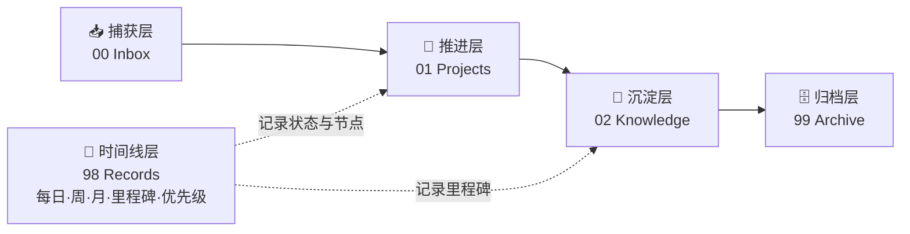
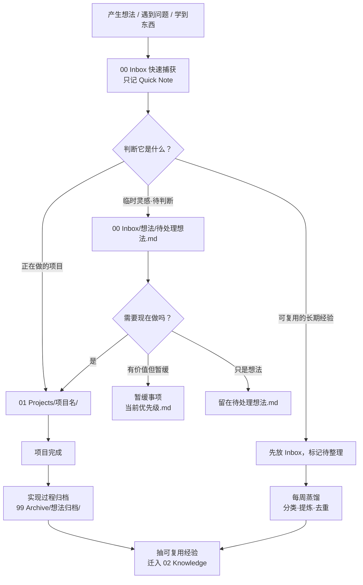
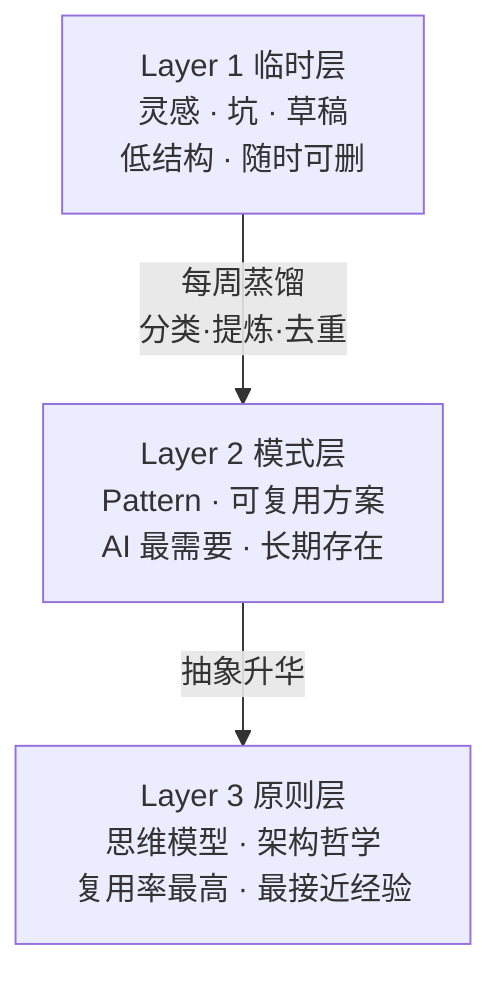
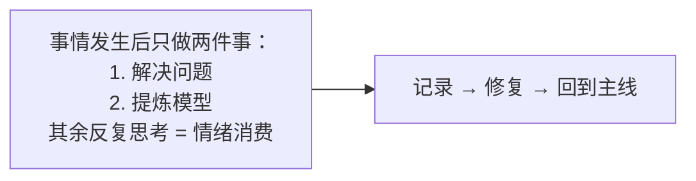

# 记录链路与记录方式

> 来源：Second Brain 知识库分析总结
> 日期：2026-06-16
> 用途：把"一条信息从产生到沉淀"的完整链路，和按内容类型选择模板的记录方式固化下来，供任何项目/AI 工具参照。

## 双链（待整理后迁移到 02 Knowledge）

- 来源分析：[[AI 知识库与工作流记录]]、[[工作规则]]、[[Agent 开发入门与规则]]、[[三分钟处理方法]]
- 后续去向：建议提炼为 `02 Knowledge/方法论/记录链路与记录方式.md`

---

## 一、记录链路总览

一条信息从产生到沉淀，按「捕获 → 推进 → 沉淀 → 归档」四层流动，时间线层贯穿全程。



### 四层定位

| 层 | 目录 | 放什么 | 生命周期 |
|---|---|---|---|
| 捕获 | `00 Inbox` | 灵感、坑、问题、未整理素材 | 最短 |
| 推进 | `01 Projects` | 正在做的项目、任务、方案、决策 | 进行中 |
| 沉淀 | `02 Knowledge` | 可复用经验、原则、思考、模板、外部资料 | 最长 |
| 归档 | `99 Archive` | 完成的实现过程、过时内容 | 冻结 |

---

## 二、一条笔记的完整生命周期



### 关键规则

- 新东西先进 `00 Inbox`，**不在一开始就过度分类**。
- 想法「先捕获，再筛选」。
- 项目做完后，经验必须**反向沉淀**回 `02 Knowledge`，不能只留在项目里。
- 归档要带：来源 / 开始日期 / 完成日期 / 持续时间 / 关键过程 / 最终结果。

---

## 三、知识三层提炼（决定"记多少、记到哪"）

平时快速记，靠定期蒸馏往上升。



### 每周蒸馏检查表（强制问自己 5 个问题）

1. 本周重复出现最多的问题是什么？
2. 本周最大的性能问题是什么？
3. 本周最大的认知升级是什么？
4. 哪些代码开始重复？
5. 哪些错误未来还会再犯？

---

## 四、记录方式：按内容类型选模板

不要统一格式，按「这是什么」选模板。

### 1️⃣ 设计/架构类（决策类）

> 核心是记**"为什么这样设计"**，不是"做了什么"。

```markdown
# 标题
## 背景
## 问题
## 错误方案
## 优化方案
## 为什么这样设计
## 优势 / 缺点
## 适用场景 / 不适用场景
```

### 2️⃣ Pattern 模式类（可复用解法）

> 比如"对象树型 loader"就该用这个。

```markdown
# Pattern 名称
## 场景
## 核心思想
## 结构
## 实现方式
## 注意事项
## 示例
```

### 3️⃣ 排障案例类（踩坑）

```markdown
# 问题标题
## 现象
## 环境
## 问题表现
## 根本原因
## 错误方向
## 解决方案
## 为什么能解决
## 如何避免
## 关联知识
```

### 4️⃣ 思维模型类（认知升级）

> 比如"思考 ≠ 解决问题"。

```markdown
# 标题
## 以前的理解
## 新的理解
## 为什么发生改变
## 核心原则
## 后续影响
```

### 5️⃣ 事件/情绪处理类（个人 SOP）

> 来自「三分钟处理方法」。

```markdown
# 事件
# 当时感受
# 事实
# 原因
# 下次方案
# 认知
```

### 6️⃣ Agent 实验复盘类

```markdown
# 实验名称
## 目标 / 输入
## Agent 设计
## 使用的工具
## 执行过程
## 结果 / 问题
## 下次改进
## 可沉淀的规则
```

---

## 五、一句话记住整条链路



> **捕获要快，蒸馏要定期，沉淀只留"为什么"，归档要带痕迹。**

---

## 六、待办（当前链路的两个断点）

1. **里程碑/优先级是空的** → 时间线层断链，做完的事没留节点，链路后半段空转。
2. **项目总结停在项目里没回流** → elpis 的总结还没提炼进 `02 Knowledge`，沉淀层接不住。
